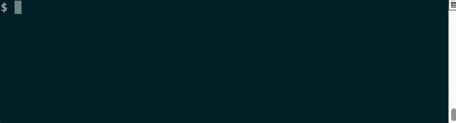

safari-bookmarks.pl
===================

safari-bookmarks is a Perl script to export Safari bookmarks (and reading
list) as plain text. It reads from ~/Library/Safari/Bookmarks.plist or
first arg (if supplied) and writes to STDOUT.

For mac only (since it relies on external tool plutil).

Output format
-------------

`title url [description]`

Usage
-----

```
safari-bookmarks.pl [-hVda] [file]

    -h, --help      help
    -V, --version   version
    -d              debug
    -a              all : export description
```

Search Safari bookmarks interactively from CLI
----------------------------------------------



- You need : [fzf](https://github.com/junegunn/fzf) (Homebrew), [URI-Find](https://github.com/schwern/URI-Find) (CPAN) and [App-uricolor](https://github.com/kal247/App-uricolor) (CPAN).
- `uricolor` colorizes URIs to distinguish them from regular text.
- `fzf` is a fuzzy finder (with many options) : use TAB for multiplie selection, press ENTER to confirm, or ESC to cancel.
- `urifind` extracts all URIs, so any text (file) will work. Try `uricolor -s` and `urifind --schemeless` to find schemeless URLs.
- Selected URIs will open with your default browser.
- Since `open` uses _LaunchServices_ to determine which program to run, most common schemes such as `ftp://` or `ssh://`  are recognized!

**Open links(s) with default application :**
```
alias lk="safari-bookmarks.pl | uricolor | fzf --ansi --exact --multi | urifind | xargs open"
```

**Copy links(s) to clipboard :**
```
alias lkc="safari-bookmarks.pl | uricolor | fzf --ansi --exact --multi | urifind | pbcopy"
```


